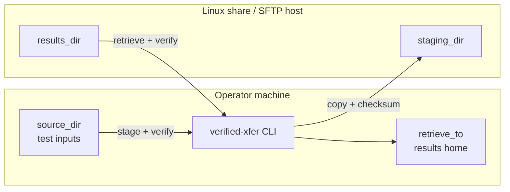
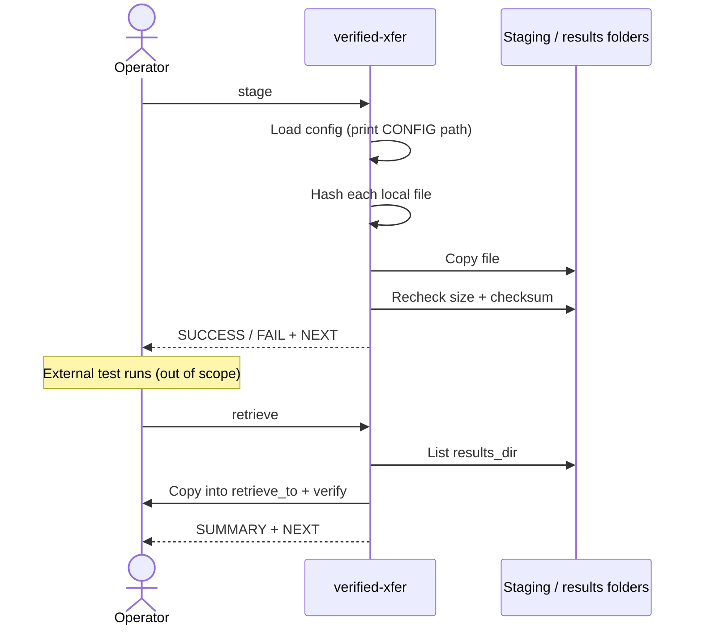

# verified-xfer

Copy test files to a Linux share, then pull results back — with a check on every file.

Built for lab operators: each step prints plain status (`PRE-FLIGHT` → `TRANSFER` → `VERIFY` → `SUCCESS` / `FAIL` → `SUMMARY` → `NEXT`) so you always know what happened and what to do next. No GUI, no daemon — one small Python CLI.

## CLI session capture

From `examples/local-demo.sh` (full log: [docs/images/cli-demo.txt](docs/images/cli-demo.txt)):

```text
=== STAGE ===
PRE-FLIGHT | 2 file(s) to stage
FILE       | meta.txt  size=8  checksum=1afd1b403a9a…
TRANSFER   | → …/staging/meta.txt
VERIFY     | OK   size=8 checksum=1afd1b403a9a…
SUCCESS    | meta.txt copied and checked at …/staging/meta.txt
SUMMARY    | OK  2/2 files staged
NEXT       | All 2 file(s) staged. Safe to continue.

=== RETRIEVE ===
SUMMARY    | OK  2/2 files retrieved
NEXT       | All 2 file(s) retrieved. Safe to continue.
```

## Architecture



- **local** backend — NFS / SMB / CIFS already mounted (or same machine).
- **sftp** backend — true remote host via paramiko (optional install).

## Sequence — stage then retrieve



## Remaining / planned

| Item | Tracking |
|------|----------|
| Automated SFTP backend test (mocked or lab host) | [#2](https://github.com/mowgli42/verified-xfer/issues/2) |
| Watch-for-test-complete / GUI / service wrappers | Out of scope (YAGNI) |

Initial epic beads B1–B12 are done — see [BEADS.md](BEADS.md).

Process: OpenSpec + Gherkin → Beads (`bd ready`) → Ponytail-minimal code.  
See [BEADS.md](BEADS.md), [openspec/specs/file-staging/spec.md](openspec/specs/file-staging/spec.md), [DESIGN.md](DESIGN.md).

## Quick start

```bash
pip install -e ".[sftp]"   # or: pip install -e .   (local/NFS only)

# Option A – config in the current folder
cp config.example.yaml config.yaml
# edit the four folder paths

# Option B – one config for the whole Windows lab PC (admin once)
#   mkdir "%PROGRAMDATA%\verified-xfer"
#   copy config.example.yaml "%PROGRAMDATA%\verified-xfer\config.yaml"

python -m verified_xfer stage --show-config-paths   # where we look
python -m verified_xfer stage --dry-run             # practice, no writes
python -m verified_xfer stage                       # copy + check inputs
# … run your external test …
python -m verified_xfer retrieve                    # pull results + logs
```

If a terminal buffers output: `python -u -m verified_xfer …`.

## Config search order

First existing file wins. The chosen path is always printed under `CONFIG | …`.

1. `--config` / `-c`
2. `./config.yaml`
3. User — `%APPDATA%\verified-xfer\` (Windows) or `~/.config/verified-xfer/`
4. System-wide — `%PROGRAMDATA%\verified-xfer\` (Windows) or `/etc/verified-xfer/`

Passwords are hidden in the log; key paths are shown.

## Troubleshooting

**[TROUBLESHOOTING.md](TROUBLESHOOTING.md)** — config discovery, permissions, SFTP auth, checksum mismatches, overwrite protection, empty results — each with recovery steps.

## Repo layout

```
openspec/specs/file-staging/   # Gherkin acceptance contract
openspec/changes/initial/      # proposal, design, tasks
beads via bd (vx-*) + BEADS.md
src/verified_xfer/             # minimal implementation
.cursor/rules/                 # ponytail + ixdf-operator-feedback + repo-health
.cursor/skills/                # Repo Health Loop fix-lane skills
DESIGN.md                      # operator feedback voice (IxDF)
```

## License

MIT — keep it simple.
